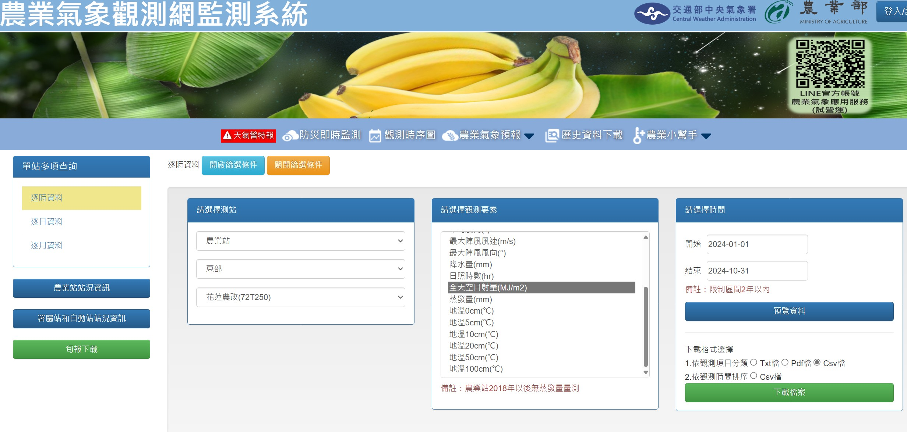

# 使用 Python 虛擬環境 Python 3.10.13

### 建立虛擬環境
- 建立虛擬環境 :
  ```sh
  python -m venv myvenv
  ```
- 啟動虛擬環境 :
  ```sh
  .\myvenv\Scripts\activate
  ```
- 安裝套件 :
  ```sh
  pip install -r requirements.txt
  ```
- 安裝 CUDA :
  ```sh
  pip3 install torch torchvision torchaudio --index-url https://download.pytorch.org/whl/cu118
  ```

### 覆現模型訓練與測試

總共有四個模型
位於  Direct_predict_models/XGboost/裡面


分別是

1. XGBoost+hualianUVI_interaction_GHI+sunAngle+insolation_removeUVITEMP

2. XGBoost+hualianUVI_interaction_GHI+sunAngle+insolation_removeUVITEMP+angle
-  (相比上方模型增加了太陽能板朝向)


3. XGBoost+hualianUVI_interaction_GHI+sunAngle+insolation_removeUVITEMP+angle_story_DNI_DHI_BEST
-  (相比上方模型 增加了DNI DHI)


4. XGBoost+hualianUVI_interaction_GHI+sunAngle+insolation_removeUVITEMP+angle_story_DNI_DHI_BEST_pseudo
- (透過上方模型的結果 加入到訓練集後 重新訓練)


####  想要複現模型訓練 只需要cd到資料夾內

1. 執行 `reappear.py`
- 此腳本會用之前存放好的超參數 以及 交叉驗證用的index 以及 獨熱編碼器重新訓練

2. 訓練完成之後 執行`reappear_test.py`

-  則會使用複現出來的模型去預測測試集結果
   其結果會存放在reappear_test裡面

3. 接著執行`format_answer.py` 就會進行格式化 
-  使其符合上傳格式 生成檔案:upload_with_answers.csv


#### 由於第四個模型 需要用到第三個模型的結果 以下是產生偽標籤步驟

1. 確認第三個模型已經覆現訓練與測試後，執行 `test_addpseudo.py`
   會把預測值與特徵結合起來 放到 data/XGBoost_pseudo_labels_traingdata 裡

2. 到 data/XGBoost_pseudo_labels_traingdata 執行 `apply_pseudo_labels.py`

3. 接著就會輸出 L1_Train_pseudo.csv ~ L17_Train_pseudo.csv

4. 接著執行第四個模型的覆現即可


### 資料前處理
> 由於需要使用 OpenWeatherMap APIKEY，故直接將處理完的資料放到 `data` 資料夾中，以下僅為步驟說明。

1. 執行 `create_final_trainingdata.py`：
   - 將第二階段的訓練集與第一階段結合，結合後的訓練集會直接更新在原先第一階段的資料夾中：`data/original_data`

2. 執行 `remove_duplicates.py`：
   - 檢查訓練集中重複的時間點，若有重複則保留第一筆資料，其餘移除，並輸出到 `remove_duplicate` 資料夾中。

3. 將 `upload(no answer).csv` 放到 `data/final_testing_data` 資料夾。
   - 執行 `expandTestData.py`：
     - 此腳本會將原先時間區間從 10 分鐘改為 1 分鐘，且格式化成 datetime 形式。
     - 輸出：`expanded_upload.csv`

4. 執行 `add_HuaLiandata_to_data.py`：
   - 此腳本會將花蓮的氣溫與紫外線，及兩者相乘的數值加入到訓練集中。
   - 輸出：`LX_Train_with_hualianData.csv`

5. 執行 `add_HuaLiandata_to_data.py --testdata` 處理測試集。
   - 輸出：`test_with_hualian.csv`

6. 開啟 `L1_Train_with_hualianData.csv` 與 `L17_Train_with_hualianData.csv`，將 1 月 1 日八點之前的時間點刪除（因為這些時間我們沒有花蓮天氣資料）。

7. 執行 `solar_data_creater.py`：
   - 此腳本會使用 OpenWeatherMap 的 API 獲取晴空天氣下的 GHI、DHI、DNI。
   - 輸出：`solar_irradiance_data_clear_sky.csv`

8. 執行 `solar_irradiance_data_clear_sky_per10min.py` 和 `solar_irradiance_data_clear_sky_permin.py`：
   - 將原先 15 分鐘的資料經過線性插值變為每分鐘的資料。
   - 最終輸出：`solar_irradiance_data_clear_sky_1min.csv`

9. 執行 `sun_Azimuth_elevation_angle_generator.py`：
   - 使用 pvlib 計算某經緯度的太陽高度角與方位角。
   - 輸出：`sun_Azimuth_elevation_angle.csv`

10. 執行 `sun_Azimuth_elevation_angle_addtoData.py`：
    - 將相對應時間的太陽高度角與方位角添加到訓練集和測試集中。

11.   透過 https://agr.cwa.gov.tw/history/station_hour 拿到花蓮全天空日射量 (詳細請見底部圖片)

   -  假設拿到的資料為 "72T250_item_hour_20241208234803.csv"

   -  執行 `Solarinsolation_filter.py`:
   - 將太陽日射量 過濾到剩下每日5點到19點

   - 執行 `Solar_Insolation_LinearInterpolation.py`：
   - 將每小時的太陽日射量進行線性插值，變為每 10 分鐘一筆資料。
   - 輸出：`Solar_Insolation_10min.csv`

12. 執行 `add_Solar_Insolation_toDATA.py`：
    - 將太陽日射量插入到訓練集和測試集中。

13. 移動到 `data/final_training_data` 資料夾，依序執行：
    - `add_angle.py`
    - `add_story.py`
    - `add_GHI_DNI_DHI.py`

14. 移動到 `data/final_testing_data` 資料夾，依序執行：
    - `add_angle.py`
    - `add_story.py`
    - `add_GHI_DNI_DHI.py`


### openweather定時戳中央氣象署API獲得溫度與紫外線

`openweather.py`


###  農業站 全天空日射量
https://agr.cwa.gov.tw/history/station_hour




